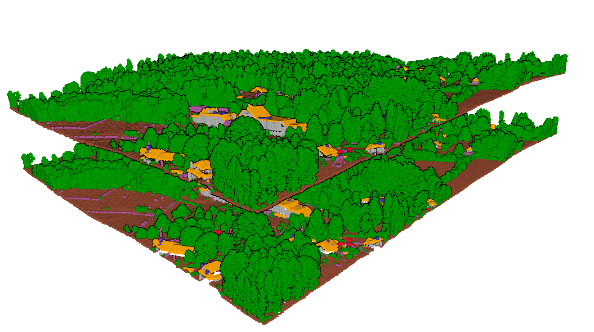
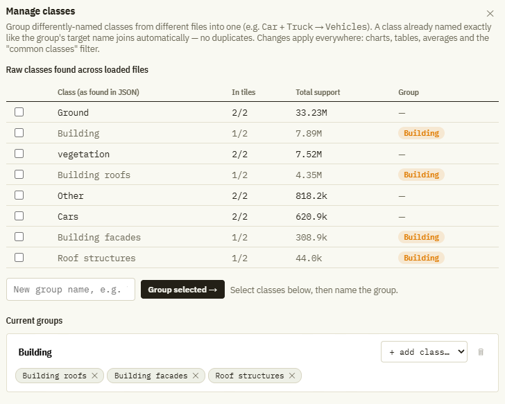
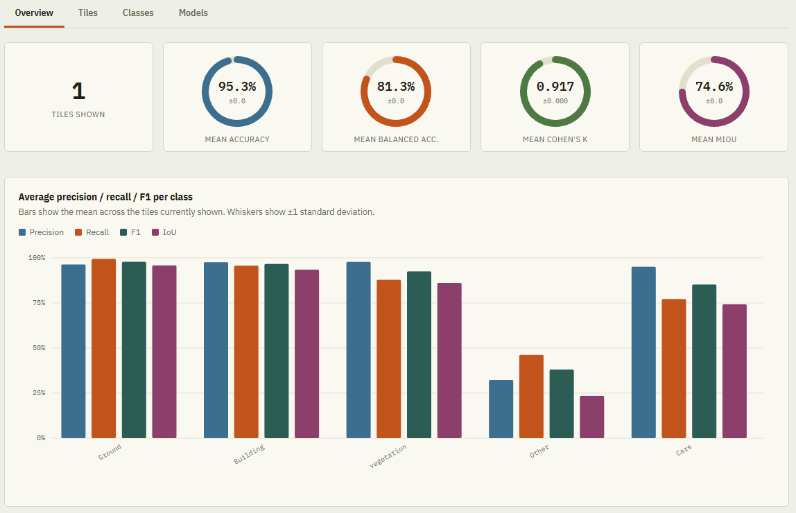
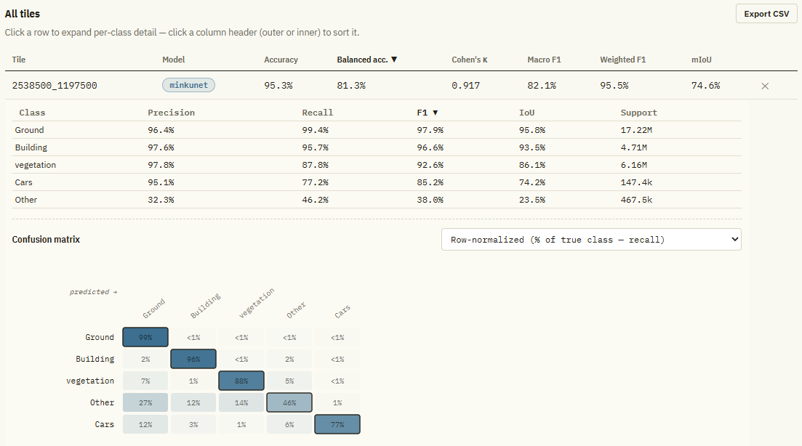
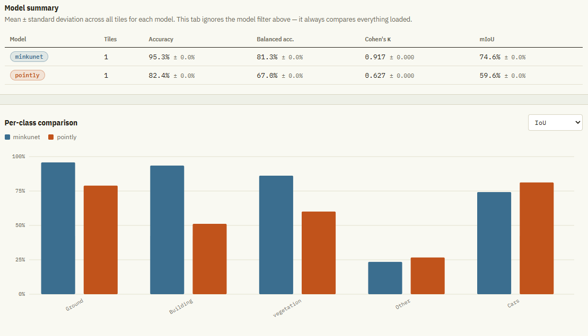

# Documentation
The aim of this library is to compare the metrics of different point cloud classifiers. In order to do so, so called reports are created while comparing the predicted point cloud to the ground truth. those can then be imported, visualised and compared with [tile_classification_dashboard.html](../tile_classification_dashboard.html)

## 1. Benchmark
The class `benchmark` from the module `semantic_segmentation_benchmark.metrics` handles point cloud formats ``(copc).laz`` and ``.las``. 
### 1.1 generate_report()
The `generate_report` static method takes at least 2 input arguments: `predictions_pc_dir`, the path to the .las/.laz file for the predicted classification point cloud and `ground_truth_pc_dir` the point cloud with the ground truth classification (the classification should be found in ``pc.classification``). Furthermore, if the point clouds have different class id, they must be remapped, thanks to ``remap_ground_truth`` and ``remap_predictions`` to a common reference which is defined as ``classification_map``. Per default, the classes provided are the following: 

| ID | Class |
| :--- | :----------------------- |
| **0**  | Other                    |
| **2**  | Ground                   |
| **3**  | vegetation               |
| **6**  | Building roofs           |
| **21** | Cars                     |
| **22** | Building facades         |
| **26** | Roof structures          |

Notice that the remapping for the predictions is dependant on the classifier. For example, the flai classifier remapping will look like this

| Predicted ID | Remapped ID |
| :------------ | :------------------- |
| **default**   | 0                    |
| **2**         | 2                    |
| **3**         | 3                    |
| **6**         | 6                    |
| **21**        | 21                   |
| **22**        | 22                   |
| **20**        | 26                   |

When creating thoses maps in the package, they have the keyword *default*, which tells the values not listed in the dictionnary which remapped value they take. There are two options:
* "default" : integer => all values not listed in the dictionnary will take this integer's value
* "default": "keep" => the values not listed in the dictionnary will be kept as is
* is the key "default" is not provided, all values that are not a key will be mapped to 0

its important to be careful while remapping, since some classifier dont predict the same number of classes. For example, in the 7 classes benchmark, *pointly* classifier actually only predicts 5 classes (the building class is aggregated). So multiple ground truth id must be remapped to the same id. This ground truth reclassification map is classed `SITN_POINTLY_REMAP` and is available in `semantic_segmentation_benchmark.constants` like other reclassification map (flai, minkunet SITN, classical SITN, deep learning SITN, pointly as well as the two ground truth remap (pointly remap and other remap)).

Another important point to mention is that most of point clouds have generated a slight $\Delta r$ with r the position (x,y,z). So the points are not exactly alligned, and have to be matched, since their index most likely differs. There are two proposed methods: bucket matching (faster, per default) and kd_tree matching, which is required if $\Delta r$ is significant. Just add the keyword argument `use_kdtree_matching=True`. In any cases, its also possible to add the ``matching_precision`` (max distance or rounding is $10^{-\mathrm{matching\_precision}}$) which is per default 3.0 (float). Notice that in ambiguous cases, some points might be removed.

The method then continues to compute some metrics which will finally be added to the *.json*. the file may then be drag and dropped into [tile_classification_dashboard.html](../tile_classification_dashboard.html), which is the visualisation of the results. 

## 1.2 Visualisation html

### 1.2.1 Load JSON Reports
A .json report can simply be added to the html with drag and drop, or using the buttom `+ add tiles`. The name of the json file should be of the format `{x_coord}_{y_coord}_{model_name}.json`. This name is important for the parsing of the input reports.

#### 1.2.1.1 Special Cases
In some cases, its possible that a report contains wierd information, if the number of elements of a given class (= support) was 0 in the ground truth. Because of this, metrics will bias the analysis. Therefore, reports of tiles that contain this problems are per default hidden with the checkbox `hide tiles with missing classes (0 support)`. They will be visible in none of the 4 tabs and will not impact the averages.

In other cases, it might be that the reports of different classifiers do not contain the same number of classes (for example pointly has 2 less). Per default, the html will only show classes that are in common. If every class is required, there is the checkbox `Show all classes` that need to be selected. 

### 1.2.2 Classes Managment
For analysis purposes, some classes might need to be aggregated sometimes. For example, building roof, building facade and roof structures need to be aggregated into building to compare flai with pointly. For the building special case, there is a pre-build aggregator in `Manage classes` called `+ Preset: Building (3 sub-classes)`. The metrics are recomputed for the aggregated group. A group can later be modified of deleted if requested by the user.

### 1.2.3 Overview Panel
The overview panel summerizes the information present in the imported reports. Notice that for the `Overview`, `Tiles` and `Classes` panel, the information shows is only the one from the selected model in the header (and is all models per default). In this panel, we see the number of tiles shown and the overall metrics, as well as the per class metrics over the entire dataset shown.

### 1.2.4 Tile Panel
The tile panel manages all the imported tiles. Itshows only the ones of the selected model and does not show the hidden ones if the button to hide tiles with missing support is selected. in `All tiles`, there is an overview of the per-tile metrics. However, it is possible to get the detailed per-class metrics by clicking on the tile. If present, there will also be a confusion matrix.

### 1.2.5 Classes Panel
This panel is straight forward. Its shows information for a chosen class for the mdel selected in the html header.

### 1.2.6 Models Panel
This panel is the most improtant one for model benchmark. It allows to compare different model's performance, overall or per-tile performance. The user can select across 4 metrics (F1, precision, recall and iou). Notice that iou is computed within the html file and is not directly provided in the *report.json*. 

Further down, there is `Compare one tile across models` which allows to compare the metrics of different models for a chosen tile. One can select or unselect a model with a click on the model name colored div.